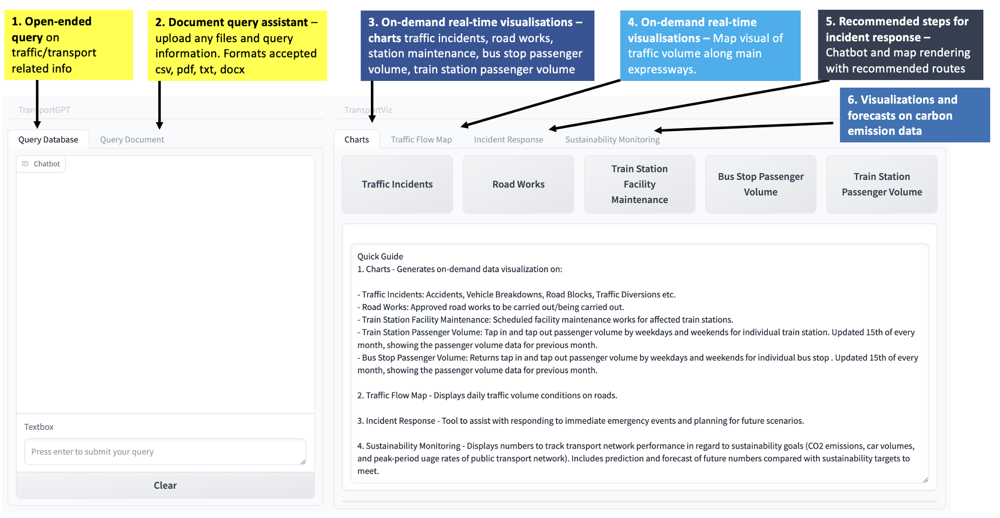
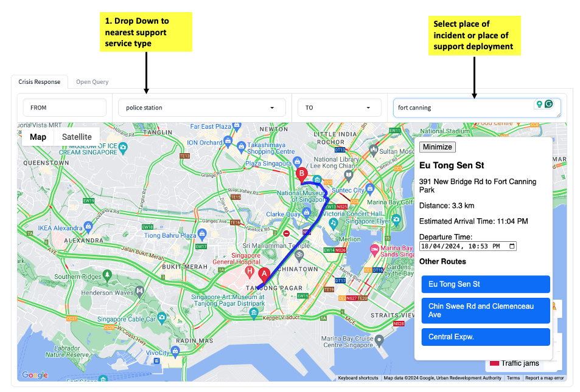
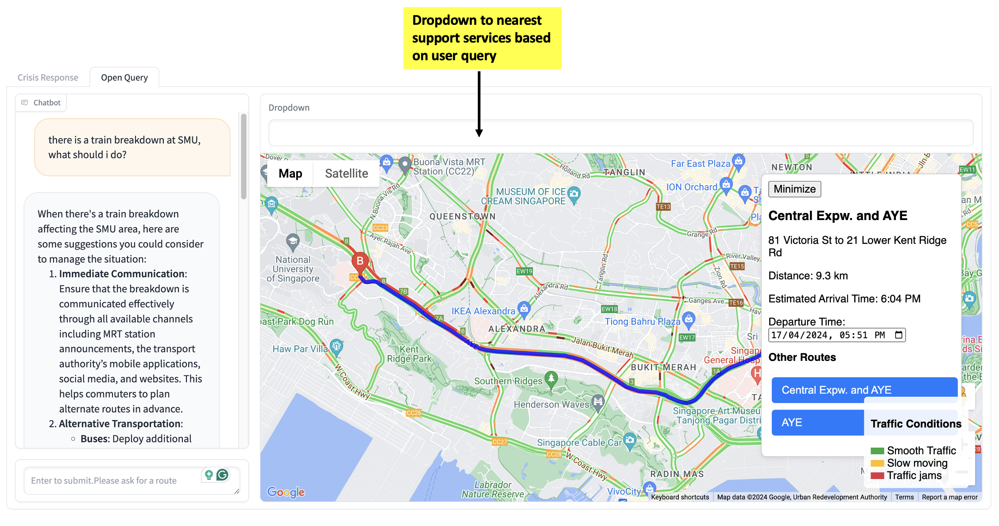
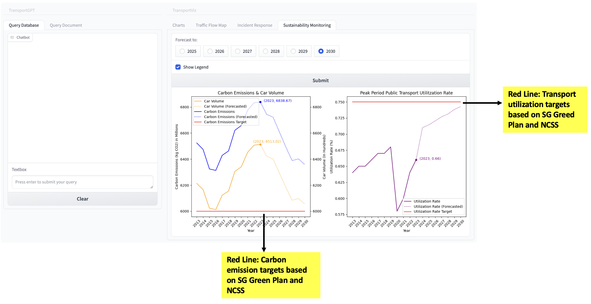
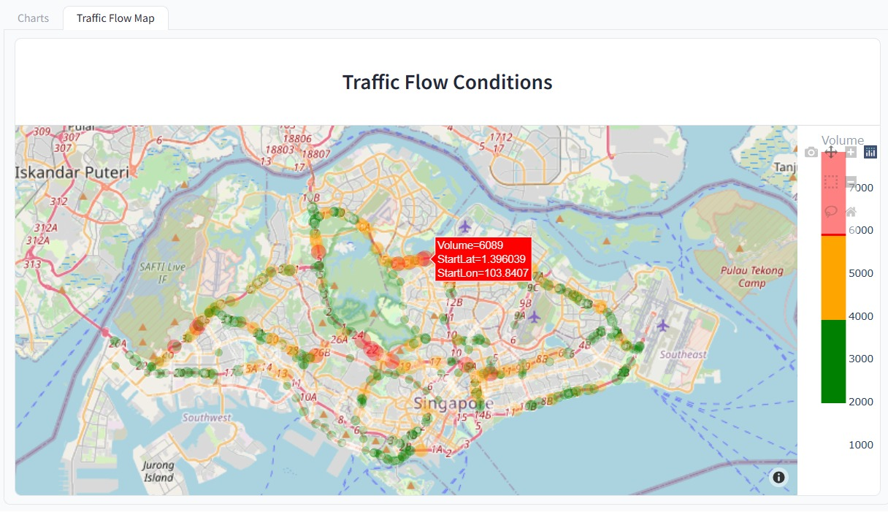

# Land Transport Intelligence (LTI)

This tool is designed to empower transport planners and policy makers in Singapore with deep, actionable insights derived from extensive transport data. Leveraging advanced large language models, this tool provides a user-friendly interface for querying complex transport conditions and analyzing custom documents related to Singapore's transportation landscape. Moreover, it helps transport planners in various scenario response and planning steps with intuitive user interface, making it easier to make decisions under pressure. 

***

***Initialize GUI***

*** 
## Features

***TransportGPT***

1. Query Transport Conditions
Real-time Insights: Ask questions through chatbot interface to receive immediate, data-driven insights with visualizations on current transport conditions across Singapore.

2. Custom Document Analysis
Document Upload: Easily upload transportation-related documents for analysis.
Intelligent Insights: Extract key information, summaries, and actionable insights from a wide range of documents, including reports, policy papers, and planning documents.

***TransportViz***

1. Visualizations 
Create on the fly visualizations on traffic flow, passenger volume by train stations, road works, traffic incidents, bus stop passenger volume and more.

2. Incident Response
Get recommended steps with visualization in case of an incident. Get information like recommended routes from the place of incident to the nearest hospital, fire station, MRT, and interchanges. You can also plan future fleet deployment in case of upcoming event.

3. Sustainability Monitoring
Create visualizations with forecast into the future about carbon emissions, car volume and transport utilization rate by year to keep track of sustainability KPIs within your organization.

***GUI***

  

  

    

  

